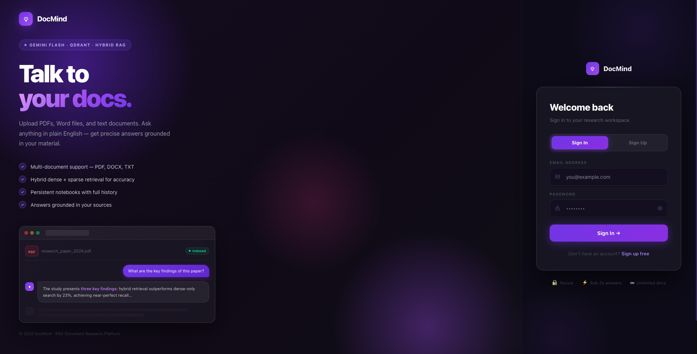
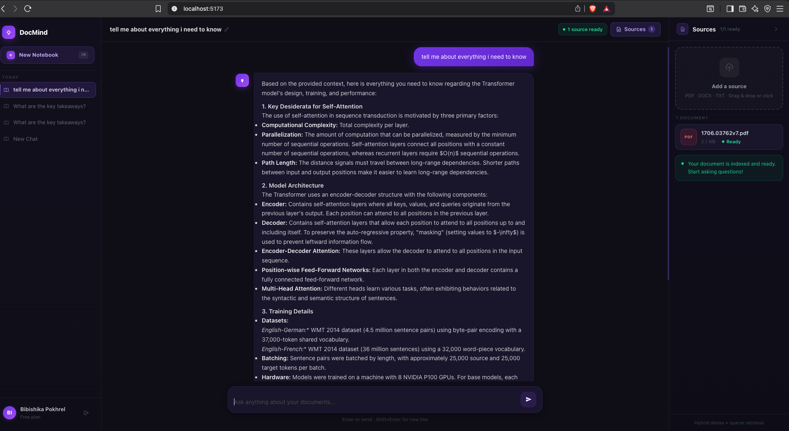

# RAG Implementation

## Overview
A full-stack web application that lets authenticated users upload documents, manage conversations, and query their content using AI-powered Retrieval-Augmented Generation (RAG).

## About
This project implements the **RAG (Retrieval-Augmented Generation)** pattern with a complete user management system. Users sign up, log in, upload documents (PDF, TXT, DOCX), and chat with an LLM that retrieves relevant context from their uploaded files.

**Problem it solves:** Searching through large documents is time-consuming. This app lets you upload files and ask natural language questions — the RAG pipeline finds relevant passages and the LLM generates accurate, context-grounded answers.

## Features
- User authentication (signup / login) with JWT
- PDF, TXT, and DOCX document upload
- Document storage in MinIO (S3-compatible object storage)
- Semantic search using dense embeddings (Qdrant vector database)
- Conversation and message history persisted in PostgreSQL
- Context-aware answer generation using Gemini Flash LLM
- React + Vite frontend with sidebar, chat area, and document viewer
- FastAPI backend with protected routes

## Architecture / Workflow

1. User signs up or logs in via the **React frontend** — a JWT token is issued.
2. User uploads a document; the **FastAPI backend**:
   - Runs the **ingestion pipeline**: extracts text, splits into chunks, generates embeddings, stores them in **Qdrant**.
   - Uploads the original file to **MinIO** and records document metadata in **PostgreSQL**.
3. User creates a conversation and submits a query.
4. The backend retrieves relevant chunks from Qdrant, sends them with the query to **Gemini Flash**, and saves the message + AI reply to PostgreSQL.
5. The frontend displays the response and maintains conversation history via the API.





## Tech Stack

| Layer | Technology |
|---|---|
| Frontend | React + Vite |
| Backend | FastAPI |
| Vector DB | Qdrant |
| Relational DB | PostgreSQL (SQLAlchemy ORM) |
| Object Storage | MinIO |
| Embeddings | Sentence Transformers |
| LLM | Gemini Flash |
| Auth | JWT + bcrypt |
| Infrastructure | Docker Compose |

## Installation

##### 1. Clone the repository
```bash
git clone https://github.com/bibishikapokhrel/rag-implementation.git
cd rag-implementation
```

##### 2. Configure environment variables

Copy the example and fill in your values:
```bash
cp .env.example .env
```

Required variables:
```
Qdrant_url=http://localhost:6333
collection_name=your-collection-name
api_key=your-gemini-api-key
JWT_SECRET_KEY=your-secret-key

# MinIO
MINIO_ENDPOINT=localhost:9000
MINIO_ACCESS_KEY=minioadmin
MINIO_SECRET_KEY=minioadmin
MINIO_BUCKET=documents
```

##### 3. Start infrastructure services

```bash
docker compose up -d
```

This starts:
- **Qdrant** — vector database at http://localhost:6333
- **PostgreSQL** — relational database at localhost:5432
- **pgAdmin** — database UI at http://localhost:5050 (admin@admin.com / admin)
- **MinIO** — object storage API at http://localhost:9000, console at http://localhost:9001

##### 4. Install Python dependencies

```bash
uv sync
```

If `uv` is not installed:
```bash
pip install uv
uv sync
```

##### 5. Install frontend dependencies

```bash
cd frontend
npm install
```

## Running the Application

You need three terminals.

**Terminal 1 — FastAPI backend:**
```bash
uv run uvicorn app.main:app --reload
```
Backend runs at http://localhost:8000. API docs at http://localhost:8000/docs.

**Terminal 2 — React frontend:**
```bash
cd frontend
npm run dev
```
Frontend runs at http://localhost:5173.

## API Endpoints

| Method | Path | Description |
|---|---|---|
| POST | `/auth/signup` | Register a new user |
| POST | `/auth/login` | Login, returns JWT |
| POST | `/ingest/ingest/` | Upload and ingest a document (auth required) |
| POST | `/chat/chat` | Send a query, get AI response (auth required) |
| GET | `/conversations/` | List user conversations (auth required) |
| POST | `/conversations/` | Create a conversation (auth required) |
| PATCH | `/conversations/{id}` | Rename a conversation (auth required) |
| GET | `/conversations/{id}/messages` | Get message history |
| GET | `/documents/` | List user documents (auth required) |
| GET | `/documents/{id}/url` | Get a presigned download URL (auth required) |
| DELETE | `/documents/{id}` | Delete a document (auth required) |
