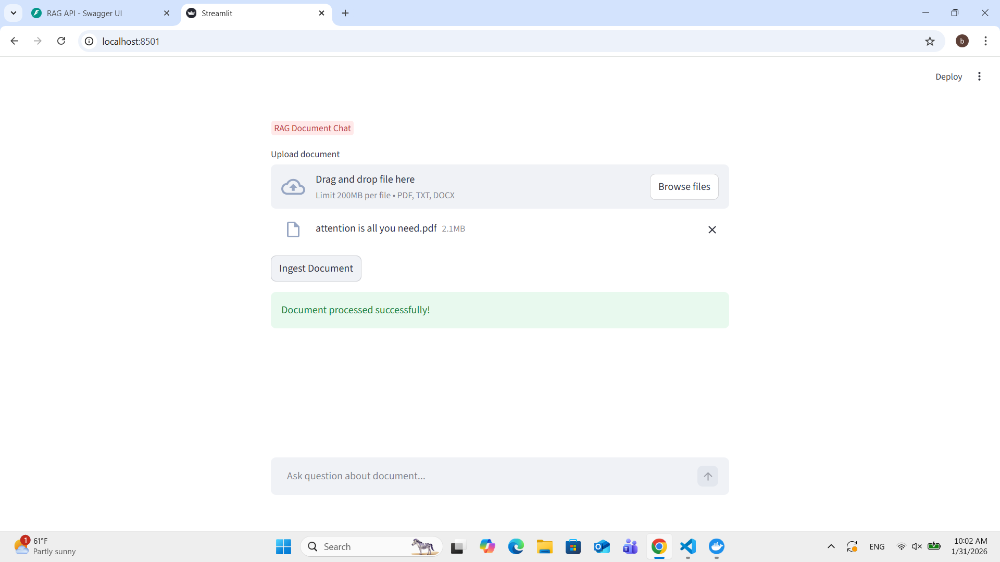

# Rag-Implementation

## Overview
This project is a web app that allows users to upload PDF files and search their content using AI.


## About
This project is a web app that implements the **RAG (Retrieval-Augmented Generation)** concept,allowing users to upload documents,ask queries and search their content using **LLM (Large Language Model)**.


**Problem it solves :** Going through huge PDFs or text files to find answers can be time-consuming and frustrating.  
   With this app, you can simply upload your documents and ask questions AI quickly finds the relevant information for you. The app uses **RAG** to give you answers that actually understand the context

##  Features
- Uploads PDF documents
- Semantic search using embeddings
- Context-aware answer generation  using LLM
- Fast document retrieval using Qdrant vector database
- Interactive chat-like interface using Streamlit
- API-based backend using FastAPI

## Architecture / Workflow

1. User uploads a PDF document via the **Streamlit frontend**.
2. The frontend sends the PDF to the **FastAPI backend**, which orchestrates the processing pipeline.
3. The **RAG pipeline** extracts text from the PDF(using pdfplumber) and splits it into manageable chunks(using langchain text splitter).
4. Sentence Transformers generate embeddings for each text chunk.
5. Embeddings are stored in the **Qdrant vector database** for efficient semantic retrieval.
6. User submits a query through the frontend.
7. The backend pipeline retrieves relevant chunks from Qdrant based on the query.
8. Gemini 3 Flash Preview LLM processes the retrieved chunks and generates a context-aware answer.
9. The backend sends the final answer back to the **Streamlit frontend**, where it is displayed to the user in a chat-like interface.




## Installation

##### 1. Clone this repository
      git clone https://github.com/bibishikapokhrel/rag-implementation.git
      cd rag-implementation

##### 2. Create a virtual environment

**macOS/Linux:**
```bash
python3 -m venv .venv
```

**Windows:**
```bash
python -m venv .venv
```

##### 3. Activate the virtual environment

**macOS/Linux:**
```bash
source .venv/bin/activate
```

**Windows:**
```bash
.venv\Scripts\activate
```

##### 4. Set up the project environment and dependencies
      uv sync


i.Automatically creates a .venv virtual environment if it doesn’t exist.

ii.Installs all project dependencies listed in uv.lock.
      
iii.Ensures all required packages are installed with the exact versions — no need to install any other libraries manually.

##### 5. Set up the infrastructure (Qdrant vector database)

Run the following command to start the required services using Docker:
```bash
docker compose up -d
```

This command starts the Qdrant vector database in detached mode, making it available at http://localhost:6333.

##### 6. Optional
If uv is not installed, first run:
      
      pip install uv


## Technologies Used

#### 1.Backend – FastAPI

FastAPI is used to build the backend API that manages document ingestion and query requests. It connects the frontend with the RAG pipeline

### 2.Frontend – Streamlit

Streamlit is used to create the user interface where users can upload PDFs, ask questions, and view AI-generated responses in a chat-like format.

### 3.Vector Database – Qdrant

Qdrant is used to store document embeddings and perform fast similarity search.

### 4.Embeddings – Sentence Transformers

Sentence Transformers are used to convert text chunks into numerical vector representations (embeddings).

### 5.LLM-Gemini-3-flash-preview
Gemini 3 Flash Preview is the Large Language Model used in this project to generate context-aware answers from uploaded documents.

### 6. Docker 
Docker is used to containerize the application environment and services, making the project easier to run, deploy, and reproduce across different systems.

## Executing program
You need to run the backend and frontend in **two separate terminals**.

1.**Run the FastAPI backend** in first terminal
    
    uv run uvicorn app.main:app --reload

This starts the backend server at
 http://localhost:8000.

API documentation is available at:
http://127.0.0.1:8000/docs
 
 This allows you to test API endpoints directly from your browser
   
2.**Run the Streamlit frontend** in second terminal
      
    streamlit run app/streamlit.py

Once the app starts, Streamlit will generate a local URL (usually http://localhost:8501).

Open this URL in your browser to view and use the frontend.